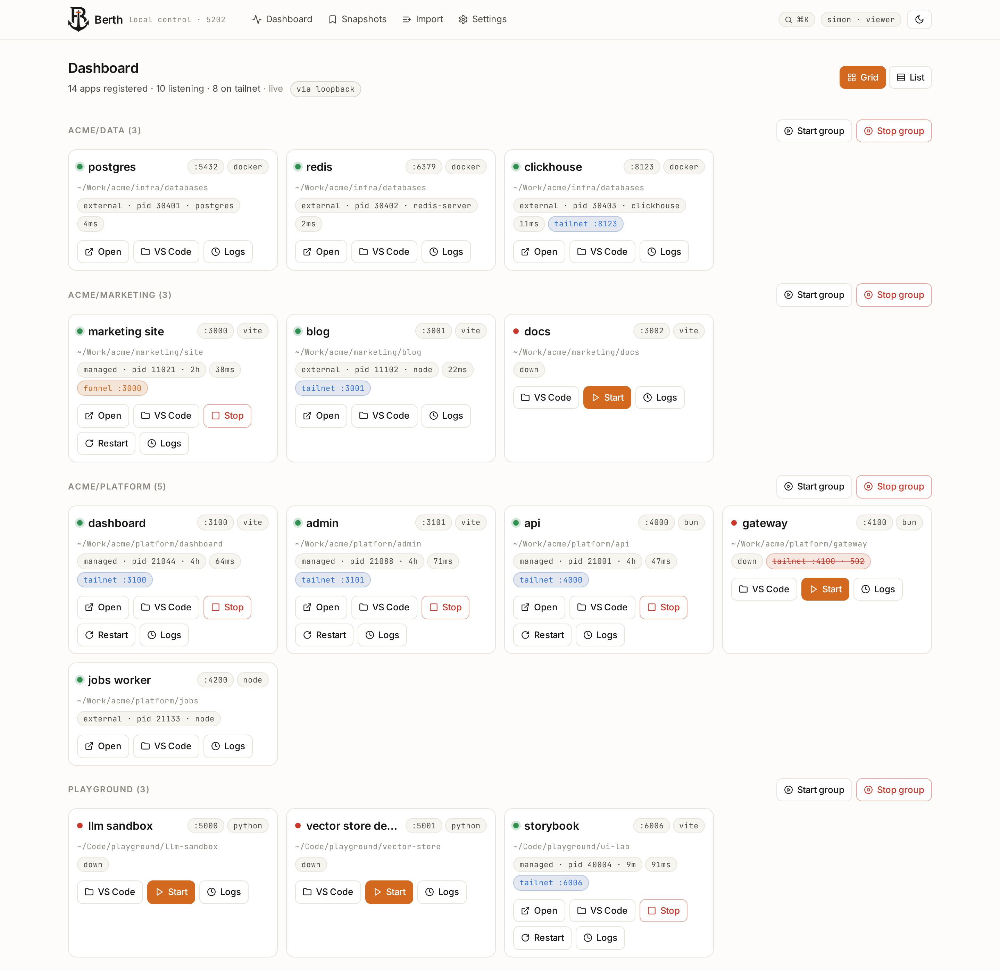
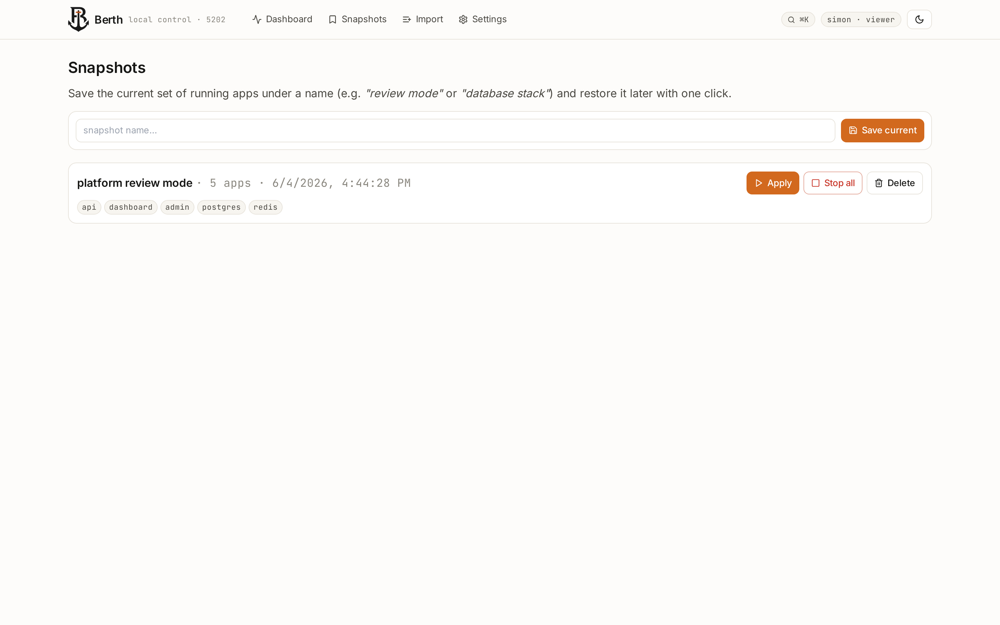

# berth-control

A local-only control panel for every dev server on your machine. One dashboard, one keystroke, one source of truth for "what's running and where."

Built for the developer who has dozens of side projects across different ports, frameworks, and runtimes and would rather not memorize them all.



## What it does

- **Discovers and lists every dev app on your box** from a markdown registry (`~/PORTS.md`) — no config files per project, no per-app YAML.
- **Live state** — every two seconds it parses `ss -tlnp`, cross-references managed PIDs, and pings healthcheck URLs. Green dot = actually serving; red dot with a "502" pill = mapped via Tailscale but the proxy target is dead.
- **Start / stop / restart** any app from the dashboard. berth-control spawns processes in their own process group so children survive berth-control restarts; SIGTERM-then-SIGKILL on stop.
- **Live logs** stream per-app over SSE. Search, filter stderr-only, follow tail, download the whole run.
- **Snapshots** save the current up-set under a name ("frontend stack", "review mode") and restore it with one click. 
- **Tailscale-aware** — reads `tailscale serve status` and shows which apps are exposed on your tailnet (or publicly via Funnel). The "Open" button auto-switches between loopback and tailnet URL depending on which pipeline you're viewing berth-control through. From your phone via tailnet, the link goes to the tailnet URL, not your phone's own `127.0.0.1`.
- **Tailscale identity** for auth — when berth-control runs behind `tailscale serve`, it reads `Tailscale-User-Login` headers. First visitor becomes admin. Direct non-loopback access is rejected.
- **Cmd-K palette** for fuzzy search across apps and actions.
- **Auto-filled start commands** — berth-control peeks at each project's `package.json` / `Cargo.toml` / `gradlew` and suggests `bun run dev` / `cargo run` / etc.

No Docker. No Swarm. No cloud. Just a SvelteKit app on one port.

## Quick start

```bash
git clone https://github.com/nguyentuansi/berth-control.git ~/Development/berth-control
cd ~/Development/berth-control
bun install
bun run dev
```

Open `http://127.0.0.1:5202` and the dashboard renders. If you have a `~/PORTS.md` table (see [PORTS.md format](#portsmd-format) below), every row gets imported on first boot.

To get start commands auto-filled, go to **Import → Run backfill** (or `POST /api/apps/backfill-start-cmds`).

## Production install

```bash
bun run build
PORT=5202 node build/index.js
```

### Systemd user unit (auto-start at login)

Create `~/.config/systemd/user/berth-control.service`:

```ini
[Unit]
Description=berth-control — local control panel
After=network.target

[Service]
Type=simple
WorkingDirectory=%h/Development/berth-control
ExecStart=/usr/bin/env node build/index.js
Restart=on-failure
Environment=PORT=5202
Environment=HOST=127.0.0.1
# Optional — comma-separated. Leading dot matches any subdomain.
# Environment=BERTH_CONTROL_ALLOWED_HOSTS=.your-tailnet.ts.net

[Install]
WantedBy=default.target
```

Then:

```bash
systemctl --user daemon-reload
systemctl --user enable --now berth-control.service
```

### Tailscale serve (access from your phone)

```bash
sudo tailscale serve --bg --https=5202 http://127.0.0.1:5202
```

berth-control now reachable at `https://<your-machine>.<your-tailnet>.ts.net:5202` for any device on your tailnet.

## Environment variables

| Variable | Default | Notes |
|---|---|---|
| `BERTH_CONTROL_PORT` / `PORT` | `5202` | Port berth-control binds to |
| `BERTH_CONTROL_HOST` / `HOST` | `127.0.0.1` | Bind address — keep on loopback unless you know what you're doing |
| `BERTH_CONTROL_DB` | `~/.berth-control/berth-control.db` | SQLite location (WAL mode) |
| `BERTH_CONTROL_PORTS_MD` | `~/PORTS.md` | Registry markdown file. If absent, registry starts empty. |
| `BERTH_CONTROL_ALLOWED_HOSTS` | `(empty)` | Comma-separated extra hostnames for Vite's `allowedHosts`. Loopback and `.ts.net` (Tailscale) are always allowed by default. Set this only for LAN hostnames or custom domains (`myapp.lan`, `.example.com`). |

## PORTS.md format

berth-control parses a markdown table of this shape on boot:

```markdown
| Port  | Project              | Path                                  | Proto | Tailscale | Systemd Service | Notes              |
|-------|----------------------|---------------------------------------|-------|-----------|-----------------|--------------------|
| 3000  | marketing site       | ~/Work/acme/marketing/site            | http  | yes       | -               | Astro landing      |
| 4000  | acme: api            | ~/Work/acme/platform (apps/api)       | http  | yes       | acme-api        | Hono + Drizzle     |
| 4200  | acme: jobs worker    | apps/jobs                             | http  | no        | -               | BullMQ background  |
| 5432  | postgres             | ~/Work/acme/infra/databases           | http  | no        | -               | Local replica      |
```

Anchor pattern: when a row's `Path` ends with `(apps/foo)`, berth-control treats the parent as a monorepo root and resolves subsequent rows with relative paths like `apps/jobs` against that root.

You don't *need* a PORTS.md to use berth-control — you can add apps directly from the UI. But if you keep a registry anyway, berth-control becomes the live view of it.

## Architecture

```
+--------------------+      +-----------------------+
|  SvelteKit (+Svelte 5)  | <—  hooks.server.ts (boot + auth)
|  src/routes/       |      |   /api/state  /api/apps/...
+----+---------------+      +-----------+-----------+
     |                                  |
     | imports                          | uses
     v                                  v
+----+-----------+   +------------------+-----------+
| lib/server/db  |   | lib/server/supervisor.ts     |
| (better-sqlite3|   | spawn / kill / re-attach     |
|  + drizzle)    |   +------------------+-----------+
+----+-----------+                      |
     |                                  | observes
     v                                  v
+----+-----------------------+   +------+------------+
| lib/server/ports-md.ts     |   | lib/server/prober |
| parse → seed apps table    |   | ss -tlnp + /proc  |
+----------------------------+   +-------------------+
                                         |
                                         v
                                +--------+---------+
                                | lib/server/      |
                                |   tailscale-serve|
                                | `tailscale serve |
                                |   status` cache  |
                                +------------------+
```

### Process supervision

berth-control spawns each app's `start_cmd` with `detached: true`, making the child its own process-group leader. The PID + pgid are persisted to the `runs` table. On berth-control restart, `reattachOnBoot()` scans open runs and re-attaches to any PID still alive. Stop sends `SIGTERM` to the negative pgid (kills the whole tree), waits 5 seconds, then escalates to `SIGKILL`.

### Live state

The SSE endpoint `/api/state` ticks every 2 seconds. It:

1. Parses `ss -tlnp` and filters to loopback / wildcard binds (so tailscaled's per-tailnet-IP serve listeners don't false-positive an app as "up").
2. Calls `getServeStatus()` which caches `tailscale serve status` output for 5 seconds.
3. Optionally fetches each app's `healthcheck_url` in parallel (2 second timeout).
4. Emits one combined snapshot per tick.

The dashboard subscribes once via `EventSource` and re-renders reactively.

### Auth

`src/lib/server/tailscale.ts` reads the `Tailscale-User-Login` request header (set by `tailscale serve` only) and looks up or creates the user. First visitor is promoted to admin; if the table somehow ends up with zero admins, the next request self-heals. Loopback requests without that header fall back to the local OS user, so running `curl http://127.0.0.1:5202/` from a terminal on the same box always works.

## Project structure

```
src/
├── app.html, app.css, app.d.ts
├── hooks.server.ts                  — boot + identity injection
├── lib/
│   ├── components/CommandPalette.svelte
│   └── server/
│       ├── db/{schema,index,migrate}.ts
│       ├── ports-md.ts              — markdown table parser + importer
│       ├── prober.ts                — ss -tlnp + /proc + healthcheck
│       ├── supervisor.ts            — spawn / kill / re-attach
│       ├── tailscale.ts             — identity from request headers
│       ├── tailscale-serve.ts       — `tailscale serve status` prober
│       └── start-cmd-suggester.ts   — package.json / Cargo.toml sniffer
└── routes/
    ├── +layout.{svelte,server.ts}
    ├── +page.{svelte,server.ts}     — dashboard (grid + list views)
    ├── apps/[id]/
    │   ├── +page.{svelte,server.ts} — detail + edit form
    │   └── logs/+page.{svelte,server.ts}
    ├── snapshots/
    ├── import/
    ├── settings/
    └── api/
        ├── state/+server.ts         — SSE live state
        ├── apps/[id]/{start,stop,restart,logs}/+server.ts
        ├── apps/backfill-start-cmds/+server.ts
        ├── bulk/+server.ts          — bulk start / stop
        ├── reap/+server.ts          — kill orphan workerd
        └── snapshots/+server.ts     — save / apply / delete
```

## Development

```bash
bun install
bun run dev             # vite dev with HMR
bun run check           # svelte-check + tsc --noEmit
bun run build           # adapter-node prod build → build/index.js
bun run preview         # run the prod build
bun run db:studio       # browse the SQLite DB in Drizzle Studio

# Demo mode (for marketing screenshots — fake apps, canned live state):
bun run demo:seed       # populates ./demo.db with fictional apps
bun run demo:dev        # runs berth-control with BERTH_CONTROL_DEMO=1 BERTH_CONTROL_DB=./demo.db
```

### Demo mode

`BERTH_CONTROL_DEMO=1` swaps the live-state pipeline for a canned snapshot tuned to show off every UI feature (mixed up/down, tailnet badges, one Funnel pill, a stale-mapping "502" diagnostic, healthcheck latencies). PORTS.md is not imported, the supervisor is not re-attached, and start/stop endpoints become no-ops — so you can screenshot the UI without your real data or the risk of spawning anything. See `src/lib/server/demo.ts` for the fixture and `scripts/seed-demo.ts` for the seeder.

The dev server runs SSR through Vite. The supervisor module holds running children in an in-memory `Map` — Vite HMR reloads can theoretically lose that map, but since PIDs are persisted, `reattachOnBoot()` recovers them on the next request. Worst case: stop a managed app and restart it.

### Adding a new managed-app kind

`src/lib/server/start-cmd-suggester.ts` picks defaults per project type. To add support for a new ecosystem (e.g. `deno run --watch`), add a branch that detects the marker file (`deno.json`) and returns the right command. The dashboard already groups by `kind` via the `Section` heading on the detail form.

### Schema migrations

Schema lives in `src/lib/server/db/schema.ts` (Drizzle). The runtime path uses `ensureSchema()` in `migrate.ts` — idempotent `CREATE TABLE IF NOT EXISTS`. For additive changes during development, `bun run db:push` applies Drizzle's diff.

## Security notes

- berth-control is **not designed to be exposed to the public internet**. It runs arbitrary shell commands from its database. Keep it on `127.0.0.1` or behind `tailscale serve` (tailnet only).
- The identity header check trusts `Tailscale-User-Login` *only* when the request reaches berth-control via loopback — same boundary as `tailscale serve` operates within. Direct non-loopback requests with that header will not be trusted.
- `start_cmd` is run via `/bin/bash -c`. If you import apps from a registry you don't control, treat them as code, not config.
- berth-control has zero authentication when run on pure loopback by an OS user — it assumes you trust whoever is logged in to the machine.

## License

MIT — see [LICENSE](./LICENSE).

## Naming

A *berth* is the slot at a dock where a single ship moors. Felt right for an app where each registered service has one port and one home. *berth-control* is the dashboard that watches every slot — the control plane for the whole harbor of dev servers on your machine.

> Formerly named **Berth**, renamed 2026-06-19 to `berth-control` to free the shorter name for an unrelated AI-agent harbor platform. Same scope, same port (5202), same intent — just `-control` on the end.
